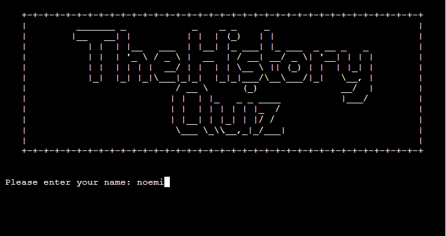

# The History Quiz

# Introduction

The History Quiz is a multi-topic, multi-choice quiz application built as Project Portfolio 3 for Code Institute Full-stack development course. It is a Python terminal game that utilizes a collection of libraries to expand functionality and runs in the Code Institute mock terminal deployed on Heroku. The main inspiration was my deep interest for old civilizations, their life and their beliefs. Hence it targets anyone who shares similar interests and has a curiosity to test themselves. 

#### [**Live Website here**](https://the-history-quiz.herokuapp.com/)

# User Experience

## User goals
- Understand the purpose of the game
- Play the game and receive feedback for each answers
- See the result after a game is played
- Store final results and compare it with other players
- Have multiple game options

## Developer goals
- Build an easy to play, interactive game
- Retrieve topics and questions from Google Spreadsheets
- Add variety so questions and answers are randomized
- Display feedback to user if input not valid
- Offer choices to user once a game is over
- Usernames and score to be stored in Google Spreadsheets

# Design

# Logic

## Flowchart
 

# Features

## Logo and username prompt 

  - When the program is launched the logo is displayed together with a prompt to input username

## Welcome and Quiz Rulez

  - Once the username is entered a welcome message is displayed with the instructions to play
  - The user is given time to read the instructions and once ready to start they can press any key

## Topic display

  - The user has the option to choose from the topics listed, by entering A,B,C,D. Any other input will raise a retry message.

## Topic names

  - After the selection has been made, the quiz starts by displaying the topic name with ASCII art

## Questions and answers
  - Currently there are 10 questions for each topic

  - The question and answer pairs are randomized and labeled.
  - The questions and answers are being printed with typewriter effect
  - If the answer is not valid a retry message is shown

## Answer feedback
  - Displays if correct:

  - Displays if incorrect:

## Result feedback
  - At the end of a quiz feedback is given according to how many questions the player gets correctly
  - Displays if less than 4 correct answers:

  - Displays if less than 8 correct answers:

  - Displays if more 8 or more correct answers:

## Menu

  - Choices after a game is finished
  - If the selection is not valid a retry message will be shown

## Leaderboard

  - If player decides to check the Leaderboard, their score will be pushed to Google Sheets then TOP 10 scores are displayed(or as many as exist)
  - Menu options show again

## Play Again
  - If the player decides to play again, the terminal window is cleared and the topics are displayed, allowing to select a new one

## Quit

  - The game will end with a thank you message

## Future Implementations

# Storage
Google Sheets is used to store all the data the project uses, starting from the questions and answers to the username and score, which the Leaderboard consists of. 
The spreadsheet is connected via Google Drive and Google Sheet API. The credentials are stored in creds.json which is further added to Git ignore to protect the sensitive data and make sure they are not made public. 
The topics are organized in separate worksheets, this way I can easily manage, update and access them. The Leaderboard is another worksheet where the **username** and **score** are stored, then the TOP 10 is displayed on the users call. 

# Testing

|Test | Completed |
|:--- |   :---:   |
|Logo displayed from game_art| Yes |
|Player asked to enter username | Yes |
|Username validation: input can not be empty and must contain minimum 3 characters | Yes |
|Welcome message displayed with capitalized username | Yes |
|Game rules displayed | Yes |
|Topic choices displayed | Yes |  
|Both uppercase and lowercase is accepted | Yes |
|Topic name imported and displayed from game_art | Yes |
|Questions/answers are displayed from correct topic | Yes |
|Questions/answers labeled and randomized | Yes |
|Topic/answer validation: input can only be A,B,C,D | Yes |
|Question feedback if correct | Yes |
|Question feedback if incorrect and show correct answer | Yes |
|Display total score and message | Yes |
|Display Menu | Yes |
|Selection validation: input can only be A,B,C | Yes |
|Select A: update and display leaderboard | Yes |
|Sort Leaderboard to return Top 10 | Yes |
|Select B: restart game and show topic choices | Yes |
|Select C: exists program | Yes |
|Typewriter effect | Yes |
|Terminal cleared | Yes |

# Technologies and resources

## Languages
- [Python](https://www.python.org/)

## Modules
- [os](https://docs.python.org/3/library/os.html): functions that interact with the OS
- [time](https://docs.python.org/3/library/time.html): used in typewriter function to define sleep time
- [random](https://docs.python.org/3/library/random.html): randomly sorts the questions and answers with the sample function
- [string](https://docs.python.org/3/library/string.html): functions to manipulate strings in the app
- [tabulate](https://pypi.org/project/tabulate/): print Leaderboard as pretty table
- [gspread](https://docs.gspread.org/en/v5.7.0/): allows access to Google Sheets
- [google.oauth2.service_account](https://google-auth.readthedocs.io/en/master/reference/google.oauth2.service_account.html): validates credentials and grants access to Google

## Programs
- [Github](https://github.com) - version control and project repo
- [Gitpod](https://gitpod.io) - used as remote development platform to write and test code
- [Heroku](https://www.heroku.com/) - live deployment of the project
- [Figma](https://www.figma.com) - for flowchart design
- [Lighthouse](https://developer.chrome.com/docs/lighthouse/overview/)
- [Patjork](https://patorjk.com/software/taag/#p=display&f=Graffiti&t=Type%20Something%20) - generate game art

# Deployment

# Credits

